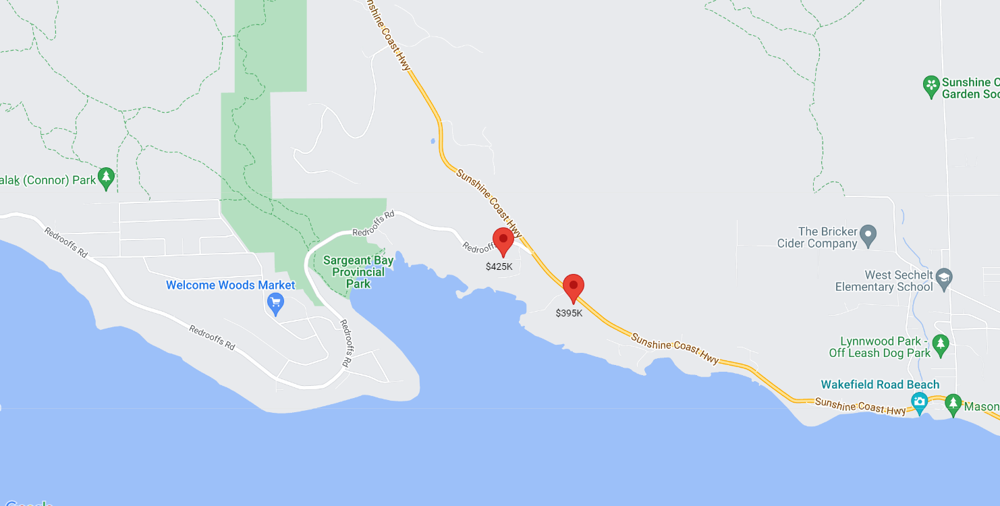

<!-- default badges list -->

<!-- default badges end -->

# Map for DevExtreme - How to add a marker with a label

This example demonstrates how to add a marker with a label to the Google map. We used the <a href="https://github.com/googlemaps/js-markerwithlabel">js-markerwithhlabel</a> library for this task.

The Map component allows obtaining the instance in the <a href="https://js.devexpress.com/jQuery/Documentation/ApiReference/UI_Components/dxMap/Configuration/#onReady">onReady</a> event handler using the <strong>originalMap</strong> parameter.

## Files to Review

- **jQuery**
    - [index.html](jQuery/index.html)
    - [script.js](jQuery/script.js)

## Documentation

- [Map Overview](https://js.devexpress.com/Documentation/Guide/UI_Components/Map/Overview/)
- [Map - API Reference](https://js.devexpress.com/Documentation/ApiReference/UI_Components/dxMap/)

## See Also

- [Map for DevExtreme - How to add the current location marker](https://www.devexpress.com/Support/Center/p/E4734)
<!-- feedback -->
## Does this example address your development requirements/objectives?

 

(you will be redirected to DevExpress.com to submit your response)
<!-- feedback end -->
